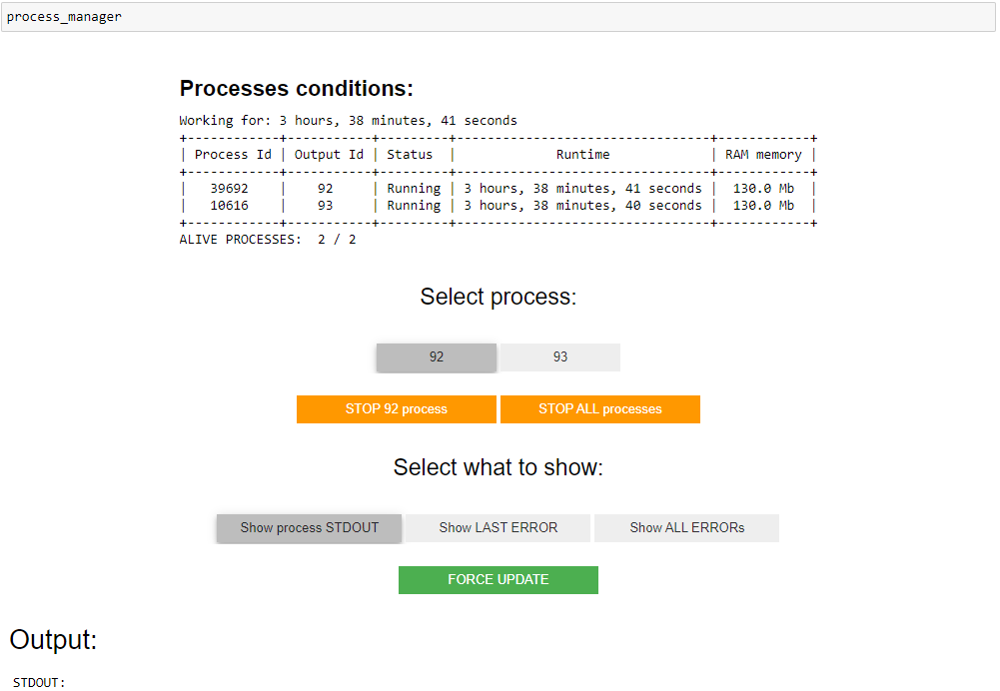

=======================
jupyter_process_manager
=======================

.. image:: https://img.shields.io/github/last-commit/stas-prokopiev/jupyter_process_manager
   :target: https://img.shields.io/github/last-commit/stas-prokopiev/jupyter_process_manager
   :alt: GitHub last commit

.. image:: https://img.shields.io/github/license/stas-prokopiev/jupyter_process_manager
    :target: https://github.com/stas-prokopiev/jupyter_process_manager/blob/master/LICENSE.txt
    :alt: GitHub license<space><space>

.. image:: https://travis-ci.org/stas-prokopiev/jupyter_process_manager.svg?branch=master
    :target: https://travis-ci.org/stas-prokopiev/jupyter_process_manager

.. image:: https://img.shields.io/pypi/v/jupyter_process_manager
   :target: https://img.shields.io/pypi/v/jupyter_process_manager
   :alt: PyPI

.. image:: https://img.shields.io/pypi/pyversions/jupyter_process_manager
   :target: https://img.shields.io/pypi/pyversions/jupyter_process_manager
   :alt: PyPI - Python Version

.. contents:: **Table of Contents**

Overview.
=========================

This is a library which helps working with many processes in a jupyter notebook in a very simple way.

Installation via pip:
======================

.. code-block:: bash

    pip install jupyter_process_manager

Usage examples
===================================================================

How to create create and start processes for **jupyter_process_manager**
-------------------------------------------------------------------------------------

.. code-block:: python

    from jupyter_process_manager import JupyterProcessManager
    process_manager = JupyterProcessManager(".")  # "." - path where to store outputs of the processes

    # And functions for processing
    process_manager.add_function_to_processing(
        func1, *func1_args,**func1_kwargs)
    process_manager.add_function_to_processing(
        func2, *func2_args,**func2_kwargs)

**WARNING: Please do NOT try to use functions defined inside jupyter notebook, they won't work.**

JupyterProcessManager arguments:
^^^^^^^^^^^^^^^^^^^^^^^^^^^^^^^^^^^

#. **str_dir_for_output**: Directory where to store processes outputs
#. **is_to_delete_previous_outputs=True**: Flag If you want to delete outputs for all previous processes in the directory

Usage in Jupyter Notebook
------------------------------------------------------------

After processes were added, you can check what is happening with them

.. code-block:: python

    process_manager

How to check output for the processes
^^^^^^^^^^^^^^^^^^^^^^^^^^^^^^^^^^^^^^^^^^^^^^^^^^^^^

| Select the process for which you want to see the output.
| Select which output you want to see.
| The output will get updated every 2 seconds.

How to add more processes
^^^^^^^^^^^^^^^^^^^^^^^^^^^^^^^^^^^^^^^^^^^^^^^^^^^^^
| You can add as many processes as you want
| by running the code below in any other jupyter notebook cell

.. code-block:: python

    process_manager.add_function_to_processing(
        func_new, *func_new_args,**func_new_kwargs)

How to stop a process
^^^^^^^^^^^^^^^^^^^^^^^^^^^^^^^^^^^^^^^^^^^^^^^^^^^^^
To stop the process, select it and press the orange button to stop it

| When the button to stop the selected process is pushed.
| KeyboardInterrupt Exception is called for the process
| If within 5 seconds process is not finished then the process will be killed.

How to do a debug run without a new process creation
^^^^^^^^^^^^^^^^^^^^^^^^^^^^^^^^^^^^^^^^^^^^^^^^^^^^^

.. code-block:: python

    # arguments are the same as in **add_function_to_processing(...)**
    process_manager.debug_run_of_1_function(func_to_process, *args, **kwargs)

Usage in a console
============================

.. code-block:: python

    process_manager.wait_till_all_processes_are_over()

You will see the output like shown below

Links
=====

    * `PYPI <https://pypi.org/project/jupyter_process_manager/>`_
    * `readthedocs <https://jupyter_process_manager.readthedocs.io/en/latest/>`_
    * `GitHub <https://github.com/stas-prokopiev/jupyter_process_manager>`_

Project local Links
===================

    * `CHANGELOG <https://github.com/stas-prokopiev/jupyter_process_manager/blob/master/CHANGELOG.rst>`_.

Contacts
========

    * Email: stas.prokopiev@gmail.com
    * `vk.com <https://vk.com/stas.prokopyev>`_
    * `Facebook <https://www.facebook.com/profile.php?id=100009380530321>`_

License
=======

This project is licensed under the MIT License.
